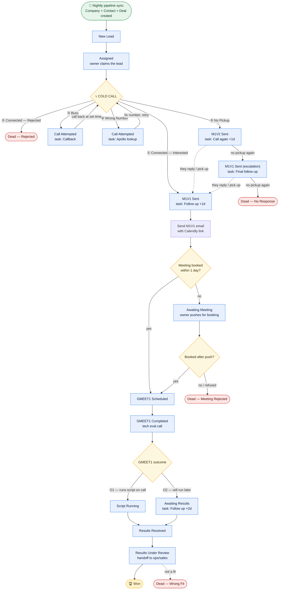

# Codebase Acquisition — Sales Workflow (start → end)

One diagram, every scenario. Renders automatically on GitHub. To get an image for
slides: copy the ```mermaid``` block into **https://mermaid.live** → Actions →
Export PNG/SVG.

**Legend:** 🔵 pipeline stage · 🟠 decision · 🔴 dead end · 🟡 won ·
**solid arrow** = normal path · **dotted arrow** = "they came back / picked up".
Outcomes ①–⑤ and their stage moves + tasks are **automated** by
`lh2 hubspot-call-outcome`; everything after the M1V1 email is a **manual** stage
move in HubSpot.



## The 5 cold-call outcomes at a glance (what the tool does for you)

| # | Situation | Deal moves to | Auto-task |
|---|---|---|---|
| **①** | Picked up, interested | **M1V1 Sent** | Follow up — no meeting booked (+1 day) |
| **②** | Picked up, hard rejection | **Dead — Rejected** | — (closed lost) |
| **③** | Picked up, busy | **Call Attempted** | Callback (at given time, else next day) |
| **④** | Wrong number | **Call Attempted** | Apollo lookup (today) → fix & retry |
| **⑤** | No pickup | **M1V2 Sent** → escalate → **Dead — No Response** | Call again → Final follow-up |

## Two nuances for the team
- **Escalation (⑤):** no-pickup once → M1V2 email; no-pickup again → M1V1 email
  (escalation); no-pickup a third time → Dead — No Response. If they reply/pick up
  at any point, you jump into the interested flow (M1V1 Sent).
- **Retries (③ ④):** Busy and Wrong-Number keep the deal alive in *Call Attempted* —
  you loop back and call again once the time comes / number is fixed.

> The pipeline also has two optional manual stages not shown as auto-steps —
> **Call Connected** (an intermediate you can use before M1V1) — the automated
> flow skips straight to *M1V1 Sent* on an interested call.
